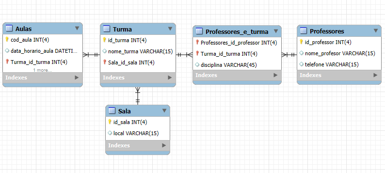

# Aula 15 - Criando tabelas e fazendo consultas

## Enunciado


## Modelo das tabelas


## Script SQL
```sql
create database Aula_15;
use Aula_15;

create table professores(
id_professor int(4) not null primary key,
nome_professor varchar(15),
telefone varchar(15)
);

create table sala(
id_sala int(4) not null primary key,
local varchar(15)
);

create table turma(
id_turma int(4) not null primary key,
nome_turma varchar(15),
sala_id int (4),
foreign key (sala_id) references sala(id_sala)
);

create table  aulas(
cod_aula int(4) not null primary key,
data_horario_aula datetime,
id_turma int(4),
foreign key (id_turma) references turma(id_turma)
);

create table professores_turma(
id_professor int(4),
id_turma int(4),
disciplina varchar(45),
foreign key (id_professor) references professores(id_professor),
foreign key (id_turma) references turma(id_turma)
);

-- inserindo dados:
insert into sala (id_sala, local) values 
(1,'Prédio 1'),
(2,'Prédio 2'),
(3,'Prédio 1');
select * from sala;
 
insert into professores(id_professor,nome_professor,telefone) values
(1,'Hamilton Milton', '(11)92223-9856'),
(2,'Frederico Rico','(11)98563-5842');
select * from professores;
 
insert into turma (id_turma,nome_turma, sala_id) values
(1,'Banco de Dados', 1),
(2,'Introdução SQL',2);
select * from turma;
-- alter table  turma modify nome_turma varchar(30);
describe turma;
 
insert into aulas (cod_aula, data_horario_aula, id_turma) values
		(1, '2025-09-01 08:00:00', 1),
		(2, '2025-09-02 14:30:00', 2);
select * from aulas;
 
insert into professores_turma (id_professor, id_turma, disciplina) values
(1, 1, 'Banco de Dados'),
(2, 2, 'SQL');
select * from professores_turma;
 
select professores.nome_professor "Nome Professor", professores_turma.disciplina "Disciplina", turma.nome_turma "Turma"
from professores inner join professores_turma on (professores.id_professor=professores_turma.id_professor)
inner join turma on (turma.id_turma=professores_turma.id_turma);
 
select professores.nome_professor "Nome Professor", turma.nome_turma "Turma", sala.local "Local sala"
from professores join professores_turma on (professores.id_professor=professores_turma.id_professor)
inner join turma on (professores_turma.id_turma=turma.id_turma)
join sala on (turma.sala_id=sala.id_sala);


